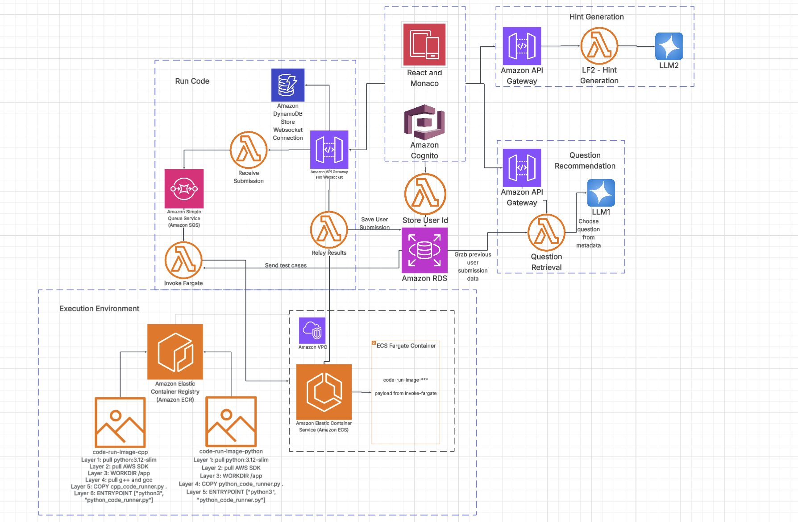

# Coding Interviewer Platform

A full-stack cloud-native platform for coding interview practice, featuring real-time code execution, AI-powered hints, and personalized question selection. Built with React, AWS Lambda, ECS Fargate, and PostgreSQL.

## System Architecture



## Table of Contents

- [Overview](#overview)
- [Architecture](#architecture)
- [Features](#features)
- [Tech Stack](#tech-stack)
- [Project Structure](#project-structure)
- [Getting Started](#getting-started)
  - [Prerequisites](#prerequisites)
  - [Frontend Setup](#frontend-setup)
  - [Backend Setup](#backend-setup)
  - [Infrastructure Deployment](#infrastructure-deployment)
- [API Documentation](#api-documentation)
- [Deployment](#deployment)
- [Development Notes](#development-notes)

## Overview

The Coding Interviewer Platform is a comprehensive solution for practicing coding interviews. It provides:

- **Interactive Code Editor**: Monaco Editor (VS Code core) with support for Python and C++
- **Real-time Code Execution**: Asynchronous code execution via AWS ECS Fargate with results delivered via WebSocket
- **AI-Powered Hints**: OpenAI integration for contextual hints based on user code and test results
- **Intelligent Question Selection**: AI-driven question recommendations based on user performance and mastery
- **User Authentication**: AWS Cognito integration for secure user management
- **Automatic User Provisioning**: Cognito PostConfirmation trigger automatically creates database user records
- **Submission History**: PostgreSQL database for tracking user submissions and performance

## Architecture

### High-Level Flow

```
Frontend (React + Vite)
    ↓
API Gateway (REST + WebSocket)
    ↓
Lambda Functions
    ├── ReceiveSubmission → SQS Queue
    ├── InvokeFargate → ECS Fargate (Code Execution)
    ├── RelayResults → WebSocket → Frontend
    ├── Question Selection (LF1) → RDS PostgreSQL
    └── Hint Generation (LF2) → OpenAI API
    ↓
ECS Fargate Tasks (Docker Containers)
    ├── Python Code Runner
    └── C++ Code Runner
    ↓
Results → Lambda → WebSocket → Frontend
```

### Components

#### Frontend
- **React 18** with Vite for fast development and optimized builds
- **Monaco Editor** for code editing (supports Python and C++)
- **AWS Cognito** for authentication
- **WebSocket Client** for real-time result delivery
- **Three-Panel Layout**: Question display, code editor, and AI chatbot

#### Backend Services

1. **ReceiveSubmission Lambda** (`Code_Run_Section/Lambdas_Source_Code/ReceiveSubmission.py`)
   - Receives code submissions via API Gateway
   - Validates input and sends messages to SQS queue
   - Handles CORS for frontend requests

2. **InvokeFargate Lambda** (`Code_Run_Section/Lambdas_Source_Code/InvokeFargate.py`)
   - Triggered by SQS queue messages
   - Retrieves test cases from RDS PostgreSQL
   - Launches ECS Fargate tasks for code execution
   - Supports Python and C++ execution environments

3. **RelayResults Lambda** (`Code_Run_Section/Lambdas_Source_Code/RelayResults.py`)
   - Receives execution results from Fargate tasks
   - Stores submission history in RDS PostgreSQL
   - Sends results to frontend via WebSocket API Gateway
   - Handles connection lookup via DynamoDB

4. **WebSocketHandler Lambda** (`WebSocketHandler.py`)
   - Manages WebSocket connections ($connect, $disconnect)
   - Stores connection mappings in DynamoDB
   - Associates connections with user IDs

5. **CognitoPostConfirmation Lambda** (`Code_Run_Section/Lambdas_Source_Code/CognitoPostConfirmation.py`)
   - Automatically triggered by AWS Cognito after user email confirmation
   - Creates user record in RDS `coder` table
   - Links Cognito user ID (sub claim) to database user record
   - Handles race conditions with ON CONFLICT clause
   - Ensures seamless user onboarding without manual database setup

6. **Question Selection Lambda** (`LF1-Question-Selection`)
   - AI-powered question recommendation
   - Analyzes user performance and mastery
   - Queries RDS for available questions
   - Returns personalized question based on preferences

7. **Hint Generation Lambda** (`LF2-Hint-Generation`)
   - Generates contextual hints using OpenAI
   - Maintains conversation state via thread_id
   - Considers user code, test results, and question context
   - Provides progressive, non-spoiling hints

#### Infrastructure

- **API Gateway**: REST API for submissions/hints/questions, WebSocket API for real-time results
- **Lambda Functions**: Serverless compute for all backend logic
- **ECS Fargate**: Containerized code execution environment
- **SQS Queue**: Message queue for code submission processing
- **RDS PostgreSQL**: Database for questions, test cases, and submission history
- **DynamoDB**: WebSocket connection tracking
- **S3 + CloudFront**: Frontend hosting and CDN
- **Cognito**: User authentication and authorization

## Features

### Code Execution
- Asynchronous code execution in isolated Docker containers
- Support for Python and C++ languages
- Test case validation with detailed results
- Runtime performance metrics

### AI Integration
- **Question Selection**: AI analyzes user history to recommend appropriate questions
- **Hint Generation**: Context-aware hints that guide without spoiling solutions
- Conversation state management for progressive hinting

### User Experience
- Real-time result delivery via WebSocket
- Three-panel interface: question, editor, chatbot
- Submission history tracking
- Performance analytics

## Tech Stack

### Frontend
- **React 18** - UI framework
- **Vite** - Build tool and dev server
- **Monaco Editor** - Code editor
- **React Router** - Client-side routing
- **Amazon Cognito Identity JS** - Authentication

### Backend
- **Python 3.x** - Lambda functions and code runners
- **AWS Lambda** - Serverless compute
- **AWS ECS Fargate** - Containerized code execution
- **PostgreSQL** - Relational database (RDS)
- **DynamoDB** - NoSQL for connection tracking
- **SQS** - Message queue
- **OpenAI API** - AI hint generation

### Infrastructure
- **AWS CloudFormation** - Infrastructure as Code
- **API Gateway** - REST and WebSocket APIs
- **S3 + CloudFront** - Static hosting and CDN
- **AWS Cognito** - Authentication service

## Project Structure

```
coding_interviewer/
├── src/                          # Frontend React application
│   ├── components/              # React components
│   │   ├── Auth/               # Login/Register components
│   │   ├── ChatBot/            # AI chatbot interface
│   │   ├── CodeEditor/         # Monaco editor integration
│   │   ├── InterviewInterface/ # Main interview interface
│   │   ├── QuestionPanel/      # Question display
│   │   └── TestResults/        # Test results display
│   ├── config/                  # Configuration files
│   │   └── aws-config.js       # AWS Cognito config
│   ├── contexts/               # React contexts
│   │   └── AuthContext.jsx    # Authentication context
│   ├── utils/                  # Utility functions
│   │   ├── api.js             # API Gateway client
│   │   ├── auth.js            # Cognito authentication
│   │   └── websocket.js       # WebSocket client
│   └── main.jsx                # React entry point
│
├── Code_Run_Section/            # Backend Lambda functions and infrastructure
│   ├── CF_Templates_Active/   # Active CloudFormation templates
│   │   ├── Main_Template.yaml # Main infrastructure stack
│   │   └── Network_Template.yaml # VPC/network configuration
│   ├── Lambdas_Source_Code/   # Lambda function source code
│   │   ├── ReceiveSubmission.py    # API Gateway → SQS
│   │   ├── InvokeFargate.py        # SQS → ECS Fargate
│   │   ├── RelayResults.py         # Results → WebSocket + RDS
│   │   ├── CognitoPostConfirmation.py # User registration → RDS
│   │   └── StoreResults.py         # Additional result storage
│   ├── Docker_Files/          # Code execution containers
│   │   ├── python_code_runner.py  # Python execution logic
│   │   ├── cpp_code_runner.py     # C++ execution logic
│   │   └── *.build              # Docker build files
│   └── lambda_packages/        # Packaged Lambda ZIP files
│
├── LF1-Question-Selection      # Question selection Lambda
├── LF2-Hint-Generation         # Hint generation Lambda
├── WebSocketHandler.py         # WebSocket connection handler
├── api-spec.yaml               # OpenAPI specification
├── frontend-deployment.yaml    # CloudFormation for frontend
├── deploy-frontend.sh          # Frontend deployment script
└── package.json                # Frontend dependencies
```

## Getting Started

### Prerequisites

- **Node.js** (v16 or higher) and npm
- **Python 3.9+** (for Lambda functions)
- **AWS CLI** configured with appropriate credentials
- **Docker** (for building code runner images)
- **AWS Account** with permissions for:
  - Lambda, API Gateway, ECS, RDS, S3, CloudFront, Cognito, DynamoDB, SQS

### Frontend Setup

1. **Install dependencies:**
   ```bash
   npm install
   ```

2. **Configure environment variables:**
   Create a `.env` file in the root directory:
   ```env
   VITE_API_GATEWAY_URL=https://your-api-id.execute-api.region.amazonaws.com/prod
   VITE_WEBSOCKET_URL=wss://your-websocket-api-id.execute-api.region.amazonaws.com/prod
   VITE_AWS_REGION=us-east-2
   VITE_COGNITO_USER_POOL_ID=us-east-2_xxxxx
   VITE_COGNITO_CLIENT_ID=your-client-id
   ```

3. **Start development server:**
   ```bash
   npm run dev
   ```
   The app will be available at `http://localhost:5173`

4. **Build for production:**
   ```bash
   npm run build
   ```
   Output will be in the `dist/` directory.

### Backend Setup

#### Lambda Functions

1. **Package Lambda functions:**
   ```bash
   cd Code_Run_Section
   python create_lambda_zips.py
   ```
   This creates ZIP files in `lambda_packages/` directory.

2. **Upload to S3:**
   Upload the Lambda ZIP files to your S3 bucket (configured in CloudFormation parameters).

#### Docker Images for Code Execution

1. **Build Python runner image:**
   ```bash
   cd Code_Run_Section/Docker_Files
   docker build -f code-run-image-python.build -t code-runner-python .
   ```

2. **Build C++ runner image:**
   ```bash
   docker build -f code-run-image-cpp.build -t code-runner-cpp .
   ```

3. **Push to ECR:**
   ```bash
   aws ecr get-login-password --region us-east-2 | docker login --username AWS --password-stdin <account-id>.dkr.ecr.us-east-2.amazonaws.com
   docker tag code-runner-python:latest <account-id>.dkr.ecr.us-east-2.amazonaws.com/code-runner-python:latest
   docker push <account-id>.dkr.ecr.us-east-2.amazonaws.com/code-runner-python:latest
   ```

### Infrastructure Deployment

#### Database Setup

1. **Create RDS PostgreSQL instance** (or use existing)
2. **Run database migrations** to create tables:
   - `coder` - User account information (linked to Cognito users)
   - `problems` - Coding questions
   - `test_cases` - Test cases for each problem
   - `submissions` - User submission history
   - `tags` and `problem_tags` - Question categorization

**Important:** The `coder` table must exist before users can register. The CognitoPostConfirmation Lambda will automatically populate this table when users confirm their email.

#### CloudFormation Deployment

1. **Deploy Network Stack:**
   ```bash
   aws cloudformation create-stack \
     --stack-name coding-interviewer-network \
     --template-body file://Code_Run_Section/CF_Templates_Active/Network_Template.yaml \
     --capabilities CAPABILITY_IAM
   ```

2. **Update parameters** in `Code_Run_Section/CF_Templates_Active/update_params.json`:
   - RDS connection details
   - S3 bucket for Lambda code
   - Cognito User Pool ID
   - ECR image URIs

3. **Deploy Main Stack:**
   ```bash
   aws cloudformation create-stack \
     --stack-name coding-interviewer-main \
     --template-body file://Code_Run_Section/CF_Templates_Active/Main_Template.yaml \
     --parameters file://Code_Run_Section/CF_Templates_Active/update_params.json \
     --capabilities CAPABILITY_IAM
   ```

4. **Configure Cognito PostConfirmation Trigger:**
   After deploying the CognitoPostConfirmation Lambda, configure it as a trigger in your Cognito User Pool:
   ```bash
   aws cognito-idp update-user-pool \
     --user-pool-id us-east-2_xxxxx \
     --lambda-config PostConfirmation=<lambda-function-arn>
   ```
   This ensures user records are automatically created in the `coder` table when users confirm their email.

5. **Deploy Frontend:**
   ```bash
   ./deploy-frontend.sh
   ```
   Or manually deploy using `frontend-deployment.yaml`:
   ```bash
   aws cloudformation create-stack \
     --stack-name coding-interviewer-frontend \
     --template-body file://frontend-deployment.yaml \
     --parameters ParameterKey=BucketName,ParameterValue=your-bucket-name
   ```

## API Documentation

The API is documented in `api-spec.yaml` (OpenAPI 3.0). Key endpoints:

### REST API

#### `POST /submit`
Submit code for evaluation.

**Request:**
```json
{
  "code": "def solution(nums, target):\n    return [0, 1]",
  "questionId": "1",
  "language": "python",
  "timestamp": "2024-01-15T10:30:00.000Z",
  "userId": "cognito-user-id"
}
```

**Response:**
```json
{
  "success": true,
  "message": "Code submitted successfully"
}
```

#### `POST /hint`
Generate AI-powered hint.

**Request:**
```json
{
  "userId": "cognito-user-id",
  "qid": 105,
  "thread_id": "thread_abc123",
  "user_code": "def twoSum(nums, target):\n    ...",
  "test_results_summary": {
    "status": "Failed",
    "first_failed_test": {
      "input": "[3,3], 6",
      "expected": "[0,1]",
      "actual": "[]"
    }
  },
  "question_desc": "Given an array..."
}
```

**Response:**
```json
{
  "hint": "It looks like your loop isn't checking...",
  "thread_id": "thread_abc123"
}
```

#### `GET /questions`
Get next question based on user preferences.

**Query Parameters:**
- `userId` (required): Cognito user ID
- `topic` (optional): Topic filter (e.g., "Arrays")
- `difficulty` (optional): "Easy", "Medium", or "Hard"

**Response:**
```json
{
  "id": "1",
  "title": "Two Sum",
  "difficulty": "Easy",
  "topic": "Arrays",
  "description": "Given an array...",
  "template": {
    "python": "def solution(nums, target):\n    pass",
    "cpp": "#include <vector>\n..."
  },
  "examples": [...],
  "constraints": [...],
  "hints": [...],
  "ai_reasoning": "Since you struggled with Arrays..."
}
```

### WebSocket API

**Connection:**
```
wss://websocket-api-id.execute-api.region.amazonaws.com/prod?userId=<user-id>
```

**Message Types:**
- `result`: Code execution results
  ```json
  {
    "type": "result",
    "testResults": {
      "passed": 2,
      "total": 3,
      "tests": [...]
    },
    "questionId": "1",
    "language": "python",
    "success": false
  }
  ```

## Deployment

### Frontend Deployment

1. **Build the frontend:**
   ```bash
   npm run build
   ```

2. **Deploy to S3:**
   ```bash
   aws s3 sync dist/ s3://your-bucket-name --delete
   ```

3. **Invalidate CloudFront cache:**
   ```bash
   aws cloudfront create-invalidation \
     --distribution-id YOUR_DISTRIBUTION_ID \
     --paths "/*"
   ```

Or use the provided script:
```bash
./deploy-frontend.sh
```

### Backend Updates

1. **Update Lambda code:**
   - Modify source files in `Code_Run_Section/Lambdas_Source_Code/`
   - Re-package: `python create_lambda_zips.py`
   - Upload to S3
   - Update Lambda function code via AWS Console or CLI

2. **Update Docker images:**
   - Modify code runners in `Code_Run_Section/Docker_Files/`
   - Rebuild and push to ECR
   - Update ECS task definition

## Development Notes

### User Registration Flow

1. User signs up via frontend → AWS Cognito User Pool
2. Cognito sends verification email to user
3. User confirms email → Cognito triggers `PostConfirmation` event
4. **CognitoPostConfirmation Lambda** automatically invoked:
   - Extracts `sub` (user ID) and `username` from Cognito event
   - Connects to RDS PostgreSQL
   - Inserts record into `coder` table with `cognito_sub`, `user_name`, and timestamp
   - Uses `ON CONFLICT` to handle duplicate triggers gracefully
5. User record now exists in database, ready for submissions and analytics

### Code Execution Flow

1. User submits code via frontend → API Gateway → `ReceiveSubmission` Lambda
2. Lambda sends message to SQS queue with code, question ID, language, user ID
3. `InvokeFargate` Lambda (triggered by SQS):
   - Retrieves test cases from RDS
   - Launches ECS Fargate task with code and test cases
4. Fargate task executes code in Docker container
5. Results sent to `RelayResults` Lambda (via SNS or direct invocation)
6. `RelayResults` Lambda:
   - Stores submission in RDS
   - Looks up WebSocket connection in DynamoDB
   - Sends results to frontend via WebSocket API Gateway

### WebSocket Connection Management

- Connections are stored in DynamoDB with `connectionId` and `userId`
- `userId-index` GSI enables lookup by user ID
- Connection lifecycle: `$connect` → store in DynamoDB, `$disconnect` → remove from DynamoDB

### Database Schema

**PostgreSQL (RDS) Tables:**
- **coder**: User account information
  - `cognito_sub` (UUID, PRIMARY KEY): Cognito user ID (sub claim)
  - `user_name` (VARCHAR): Username
  - `u_time_stamp` (TIMESTAMP): Record creation/update timestamp
  - Automatically populated by CognitoPostConfirmation Lambda on user registration
- **problems**: Question metadata (id, title, difficulty, description, templates)
- **test_cases**: Test inputs/outputs for each problem
- **submissions**: User submission history
  - `user_sub` (UUID): References `coder.cognito_sub`
  - `problem_id` (INTEGER): References `problems.id`
  - `code` (TEXT): Submitted code
  - `language` (VARCHAR): Programming language
  - `status` (VARCHAR): 'pass' or 'fail'
  - `runtime_ms` (NUMERIC): Execution time in milliseconds
  - `created_at` (TIMESTAMP): Submission timestamp
- **tags** / **problem_tags**: Question categorization

**DynamoDB Tables:**
- **connections**: WebSocket connection tracking
  - `connectionId` (String, PRIMARY KEY): WebSocket connection ID
  - `userId` (String): Cognito user ID (indexed via GSI)
  - `connectedAt` (String): Connection timestamp

### Environment Variables

**Frontend (.env):**
- `VITE_API_GATEWAY_URL`: REST API endpoint
- `VITE_WEBSOCKET_URL`: WebSocket API endpoint
- `VITE_AWS_REGION`: AWS region
- `VITE_COGNITO_USER_POOL_ID`: Cognito User Pool ID
- `VITE_COGNITO_CLIENT_ID`: Cognito App Client ID

**Lambda Functions:**
- Database connection strings (DB_HOST, DB_USER, DB_PASS, DB_NAME, DB_PORT)
- SQS queue URLs
- ECS cluster/task definition names
- WebSocket API endpoint
- DynamoDB table names
- OpenAI API key (for hint generation)

### CORS Configuration

The API Gateway is configured to allow requests from:
- `http://localhost:5173` (development)
- `http://localhost:5174` (alternative dev port)
- CloudFront distribution URL (production)

Additional origins can be configured via `ALLOWED_ORIGINS` environment variable.

### Security Considerations

- All API endpoints require Cognito authentication (ID token in Authorization header)
- Code execution runs in isolated Docker containers
- RDS database is in private subnets
- WebSocket connections are authenticated via query parameter (userId)
- IAM roles follow least-privilege principle

## License

[Add your license here]

## Contributing

Jesse Noppe-Brandon: Overall System Design Architecture, AI Logic, UI/UX Design Assistance, Database Schema Design
